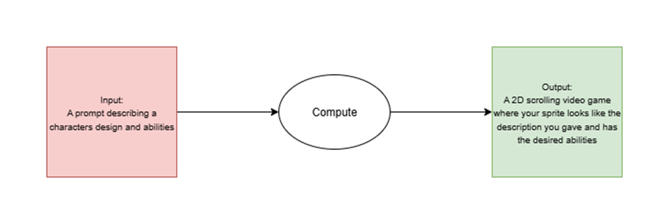
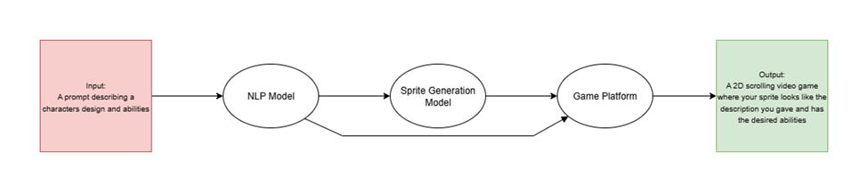
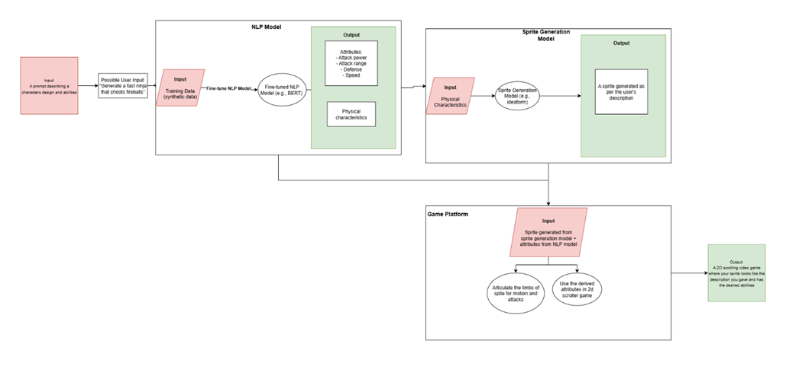

# Design Diagrams:
Conventions followed when creating design diagrams:
-	Box: well defined process
-	Oval: process yet to be defined
-	Green: output
-	Red: input
-	Arrows: flow of logic

## Design D0: 
Below is the basic I/O to our project. An end user would describe a character they’d like to generate in natural language. Our project breaks down that prompt and generates the character. Additionally, the user would be able to use that character in a simple 2D scrolling video game.

## Design D1:

## Design D2:
