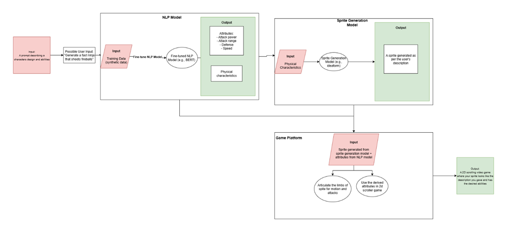

# PixelForge User Manual

## Project Team & Project Description
Read more about the development team behind PixelForge and what the project is [here](https://github.com/skyler-simpson/senior_design)!

## At a high level, how does PixelForge work?

The image above is the design diagram for our project. It is read from left to right, starting with the red input square. As stated, you, the user, is prompted to describe your character and its abilities. This description is then sent to our Natural Language Processing (NLP) model.

The NLP model reads what you've inputted and then writes a description of its own. This description is everything the model thinks is important/relevant to generating your described character. It's important to have the NLP model as its generated description is phrased in a way that makes it easy for the sprite generation model to build your characer.

Once we get the NLP model's description, the sprite generation model uses Google's Nano Banana to generate the sprite sheet. This sprite sheet (examples below) is a PNG file which contains images of the character performing different actions (walking, running, jumping, etc). This sprite sheet is then sent over to the game platform.

The game platform is built on an engine called GoDot. It is a free, open-source game engine that is used to develop 2D or 3D games. It is used to build out the minigame that the user will be able to interact with. As input, it takes in the sprite sheet from the NLP model and uses it to render the character in the minigame.

Once the character is rendered, users will be able to play in the 2D minigame with the character that they described in the beginning.

## Examples of sprite sheets

## FAQ

### 1. How do I create my game character?
Users will be able to enter their character description in a user prompt box. 
### 2. What should I include in my prompt? 
You should include various characteristics of what you want your game character to look like in your prompt. Be as descriptive as possble and include details such as clothing,abilities and overall theme. 
### 3.What is an example of a good character prompt?
A good prompt clearly describes the character’s appearance, style, and abilities in one or two sentences. For example:
“A tall armored knight wearing silver plate armor with a red cape, carrying a large shield and glowing sword, pixel-art 8-bit style.”

Including details such as clothing, colors, weapons, powers, or personality traits helps the system generate more accurate and visually consistent sprites.
### 3. How long does the game generation process take? 
The whole end-to-end sprite/game generation process should take between 2-3 minutes. 
### 4. What can I do if my character doesn't look right? 
If you are not happy with how your character looks you can generate a new character! Feel free to generate a new game character after you're done playing the game 
### 5. Can I create multiple characters? 
Unfortunately we only support one character per game at this point of time but you are able to create them as many times as you want. 
### 6. What happens if the character generation fails? 
If the character generation fails, check your internet connection and try again. Also try restarting the application if issues persist 
### 7. Are there limits on prompt length? 
Yes, extremely long prompts may be truncated. Keep descriptions concise but descriptive.
